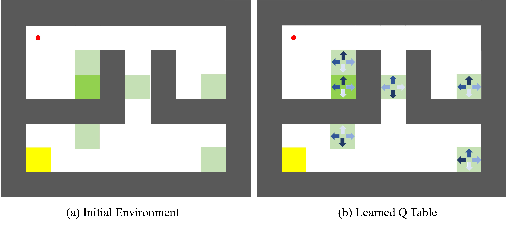

<h1 align = "center">Efficient Offline Reinforcement Learning via Peer-Influenced Constraint</h1>

## 🧠 Motivation and Key Contribution: Beyond Conservative Policy Regularization in Offline RL

A central challenge in **offline reinforcement learning** is the **distributional shift** between the learned policy and the behavior policy: once the policy queries actions unseen in the dataset, Q-value estimation becomes unreliable, potentially leading to performance collapse.

Most existing methods (e.g., TD3+BC, AWAC, IQL) address this by enforcing **policy regularization**, constraining the learned policy to stay close to dataset actions. While this helps avoid OOD actions, it also introduces two major limitations:

- ❌ **Over-conservativeness**: Policies are often restricted to suboptimal actions present in the dataset, limiting improvement.
- ❌ **One-to-one mapping**: Actions are matched only to the current state, ignoring useful actions in similar states.

### Our Motivation
> **Can we use similar states in the dataset to guide action selection, thereby improving generalization while still staying in-distribution?**

### Our Solution: Peer-Influenced Constraint (PIC)

We propose **PIC**, a simple yet effective mechanism that **constructs a candidate action set from similar (peer) states** in the dataset. Instead of relying solely on the behavior action for each state, the policy can select from actions observed in **peer states**, enabling more flexible and data-supported learning.

- ✅ We select the best action via a **max-min Q-value** criterion, filtering out noisy or poor actions.
- ✅ This **breaks the rigid state-action constraint** in prior methods and helps the policy generalize beyond what is directly seen.

###  EPIC: Robust Extension with Uncertainty Coupling
We further develop **EPIC**, which combines PIC with lightweight **ensemble-based uncertainty estimation**. This reveals a novel:

> **Coupling Effect**:  
> When **PIC is strong**, uncertainty is naturally reduced.  
> When **PIC is weak**, **uncertainty estimation** helps reject unreliable actions—forming a **self-regulating loop**.

### Key Contributions

- ✨ We propose **PIC**, a peer-based constraint framework that **enables flexible and generalizable policy learning** without falling into OOD regions.
- ✨ We introduce **EPIC**, leveraging uncertainty-aware ensembles and revealing a **Coupling Effect** that boosts performance and stability at low cost.
- ✨ We provide **theoretical bounds** on policy performance under PIC, linking state/action similarity to suboptimality.
- ✨ We demonstrate strong empirical results on D4RL and sparse-reward tasks (e.g., AntMaze, Adroit), showing **clear advantages over standard policy regularization methods**, especially in low-coverage or suboptimal data settings.

In summary, **PIC and EPIC offer a new direction for offline RL**:  
**learning not just from where you've been, but from where others like you have been.**

---

## 📊 Strengthened Empirical Validation: Statistical Testing and Robust Comparisons

### **Clarifying the Scope and Goals of Offline RL Evaluation**
It is important to note that **no single offline RL method** can be expected to excel across **all tasks**. Given the variety of environments (e.g., **MuJoCo**, **Adroit**, **AntMaze**) and the inherent differences in dataset coverage, it is **difficult** for any method to show consistent superiority.

Our focus has been on **robust generalization** and **competitive performance** across a wide range of tasks. 

In our original experiments, we conducted extensive evaluations, including:

- A comprehensive benchmark on **36 D4RL tasks**, which covers a broader range than most existing offline RL works.
- **Training curves and average return comparisons** across these tasks.
- Additional custom experiments, such as:
  - Performance on **offline-to-online D4RL tasks**.
  - Extension of **PIC to SAC and IQL**.
  - **Policy generalization in sparse reward tasks**.

These results provide **solid and diverse evidence** supporting the effectiveness and adaptability of our method.

### Response to Concerns on State Similarity in Gridworld

We appreciate the reviewer’s concern regarding the potential limitations of **L2 distance** in capturing semantic similarity, especially in environments like Gridworld where states can appear close in Euclidean terms but behave very differently in the context of the policy. To address this, we conducted **additional experiments** specifically in Gridworld.

     

Figure 1. Gridworld with peer states and learned q-table

- **Experiment Setup**:
   **Figure 1 (a)** shows a **Gridworld setup** where the deep green represents a given state, light green represents similar states (peer states), yellow represents the target point, and the red dot represents the starting point. This grid visualizes the issue where states, though close in Euclidean space, may have very different effects on the policy.

- **Q-Table Insights**:
   **Figure 2 (b)** displays the **learned Q-table**, where we see that the **max-min Q-value selection** mechanism ensures that non-optimal actions from similar states are filtered out. This mechanism assigns reasonable Q-values to the candidate actions, improving the **robustness** and **quality** of action selection.

- **Key Findings**:
   - Our **max-min mechanism** ensures that even when two states are close in Euclidean distance, the action chosen for policy optimization remains effective, as the mechanism prevents suboptimal actions from interfering with decision-making.
   - These experiments demonstrate the **robustness** of our method in cases where the L2 distance does not fully capture the true relationship between states in the **policy space**, reinforcing the validity of our approach in sparse or complex environments.

This additional experimentation validates that our method can handle state distance challenges and further strengthens our claims regarding its **generalization** and **robustness**.

###  **Enhanced Reporting with Statistical Evidence**
In response to reviewers' concerns about the **lack of statistical testing** and the need for more rigorous validation, we have strengthened our empirical section by adding the following:

- **Standard deviations** for all baseline methods where they were previously missing in the tables.
- **Statistical significance testing** using **Friedman test** and **Nemenyi test**, ensuring that the observed differences in performance are robust and not due to random variations.
- **Best performance comparisons** (using **CORL** data: [[link](https://github.com/tinkoff-ai/CORL)]) to further assess how our method performs when maximizing across runs.

---

###  **Key Findings from Statistical Analysis**
- On **MuJoCo** and **Adroit**, our method demonstrates **significant improvements** over the **top 3 baselines**, especially in terms of **generalization** and **performance stability**.
- On **AntMaze**, while we did not observe statistical significance due to the smaller number of tasks, our method’s **average performance** is still **highly competitive**, indicating that its advantages are not limited to only certain tasks.
- **Best Performance Comparisons**: The addition of these comparisons shows that our method achieves **improved performance**, even when performance variability is considered.

### **Summary and Response to Reviewers**
These additions directly address the reviewers' feedback:

- **Statistical analysis** is now included and results are reproducible, ensuring our claims are backed by **solid empirical evidence**.
- The **performance improvements** of our method, especially in **generalization**, are supported by rigorous statistical tests and further comparisons with existing methods.

We thank the reviewers for their valuable feedback, which has helped us enhance the **robustness** of our empirical validation.

  Table 1. Average normalized score over the final evaluation and five seeds on the Gym-MuJoCo tasks

|Task Name                |TD3+BC               | IQL         |CQL           |SAC-RND                |PRDC        |SAC-N                 |EDAC                 |PIC-TD3, our         |EPIC, our            |
|-------------------------|---------------------|-------------|--------------|-----------------------|------------|----------------------|---------------------|---------------------|---------------------|
|halfcheetah-random       |     30.9       ± 0.4| 19.5 ± 0.8  |**31.1** ± 3.5|27.6 ± 2.1             |26.9 ± 1.0  |28.0 ± 0.9            |28.4 ± 1.0           |25.3 ± 2.1           |28.9 ± 1.4           |
|halfcheetah-medium       |54.7 ± 0.9           | 50.0 ± 0.2  |46.9 ± 0.4    |66.4 ± 1.4             |63.5 ± 0.9  |67.5 ± 1.2            |65.9 ± 0.6           |     68.4      ± 2.4      |**68.9** ± 2.7       |
|halfcheetah-expert       |93.4 ± 0.4           | 95.5 ± 2.1  |97.3 ± 1.1    |102.6 ± 4.2            |-           |105.2 ± 2.6           |     106.8      ± 3.4|104.2 ± 3.2          |**107.9** ± 6.4      |
|halfcheetah-medium-expert|89.1 ± 5.6           | 92.7 ± 2.8  |95.0 ± 1.4    |**108.1** ± 1.5        |94.5 ± 0.5  |     107.1       ± 2.0|106.3 ± 1.9          |99.8 ± 1.6           |103.8 ± 3.8          |
|halfcheetah-medium-replay|45.0 ± 1.1           | 42.1 ± 3.6  |45.3 ± 0.3    |51.2 ± 3.2             |55.0 ± 1.1  |     63.9       ± 0.8 |61.3 ± 1.9           |63.1 ± 0.9           |**64.8** ± 1.5       |
|halfcheetah-full-replay  |75.0 ± 2.5           | 75.0 ± 0.7  |76.9 ± 0.9    |81.2 ± 1.3             |–           |84.5 ± 1.2            |     84.6      ± 0.9 |83.7 ± 1.1           |**87.3** ± 1.0       |
|hopper-random            |8.5 ±  0.6           | 10.1 ± 5.9  |5.3 ± 0.6     |19.6 ± 12.4            |26.8 ± 9.3  |**31.3** ± 0.0        |25.3 ± 10.4          |25.4 ± 3.2           |     27.9      ± 4.2 |
|hopper-medium            |60.9 ± 7.6           | 65.2 ± 4.2  |61.9 ± 6.4    |91.1 ± 10.1            |100.3 ± 0.2 |100.3 ± 0.3           |     101.6      ± 0.6|100.7 ± 1.5          |**102.2** ± 0.5      |
|hopper-expert            |109.6 ± 3.7          | 108.8 ± 3.1 |106.5 ± 9.1   |109.8 ± 0.5            |–           |110.3 ± 0.3           |110.1 ± 0.1          |     111.8 ± 2.1     |**112.2** ± 1.5      |
|hopper-medium-expert     |87.8 ± 10.5          | 85.5 ± 29.7 |96.9 ± 15.1   |109.8 ± 0.6            |109.2 ± 4.0 |110.1 ± 0.3           |     110.7 ± 0.1     |105.6 ± 1.1          |**112.3** ± 0.9      |
|hopper-medium-replay     |55.1 ± 31.7          | 89.6 ± 13.2 |86.3 ± 7.3    |97.2 ± 9.0             |100.1 ± 1.6 |101.8 ± 0.5           |**102.8** ± 0.5      |100.5 ± 1.3          |     102.0 ± 1.0     |
|hopper-full-replay       |97.9 ± 17.5          | 104.4 ± 10.8|101.9 ± 0.6   |     107.4 ± 0.8       |–           |102.9 ± 0.3           |105.4 ± 0.7          |105.8 ± 0.8          |**107.6** ± 1.6      |
|walker2d-random          |2.0 ± 3.6            | 11.3 ± 7.0  |5.1 ± 1.7     |18.7 ± 6.9             |5.0 ± 1.2   |     21.7 ± 0.0       |16.6 ± 7.0           |14.6 ± 4.1           |**22.4** ± 1.6       |
|walker2d-medium          |77.7 ± 2.9           | 80.7 ± 3.4  |79.5 ± 3.2    |92.7 ± 1.2             |85.2 ± 0.4  |87.9 ± 0.2            |92.5 ± 0.8           |     94.9 ± 2.2      |**95.9** ± 3.2       |
|walker2d-expert          |110.0 ± 0.6          | 96.9 ± 32.3 |109.3 ± 0.1   |104.5 ± 22.8           |–           |107.4 ± 2.4           |     115.1 ± 1.9     |114.6 ± 1.5          |**117.7** ± 2.1      |
|walker2d-medium-expert   |110.4 ± 0.6          | 112.1 ± 0.5 |109.1 ± 0.2   |104.6 ± 11.2           |111.2 ± 0.6 |**116.7** ± 0.4       |114.7 ± 0.9          |114.4 ± 0.9          |     116.4 ± 1.7     |
|walker2d-medium-replay   |68.0 ± 19.2          | 75.4 ± 9.3  |76.8 ± 10.0   |89.4 ± 3.8             |92.0 ± 1.6  |78.7 ± 0.7            |87.1 ± 2.4           |**95.5** ± 2.4       |     95.2 ± 2.2      |
|walker2d-full-replay     |90.3 ±  5.4          | 97.5 ± 1.4  |94.2 ± 1.9    |     105.3 ± 3.2       |–           |94.6 ± 0.5            |99.8 ± 0.7           |103.0 ± 1.9          |**107.4** ± 2.2      |
|**Average**              |70.4                 | 72.9        |73.7          |82.6                   |–           |84.4                  |     85.2            |85.1                 |**87.8**             |
|**Friedman test**         |                      |              |            |                       | **p < 0.05**|                       |                      |                      |                      |
|**Nemenyi test**          |          -           |  -           |    -       |     **p < 0.05**      | -           |**p < 0.05**           |**p < 0.05**          |**p < 0.05**          |-                     |

  Table 2. Average normalized score over the final evaluation and five seeds on the AntMaze tasks

| Task Name                  | TD3+BC      | IQL        | CQL  | SAC-RND     | PRDC           | MSG                  | SAC-BC-N              | PIC-TD3, our | EPIC, our               |
|----------------------------|-------------|------------|------|-------------|----------------|----------------------|-----------------------|----------------|-----------------------|
| antmaze-umaze              | 66.3 ± 6.2  | 83.3 ± 4.5 | 74.0 | 97.0 ± 1.5  | **98.8** ± 1.0 | 97.9 ± 1.3           |      98.6 ± 0.5       | 96.4 ± 3.5     |      98.6 ± 0.5       |
| antmaze-umaze-diverse      | 53.8 ± 8.5  | 70.6 ± 3.7 | 84.0 | 66.0 ± 25.0 | 90.0 ± 6.8     | 79.3 ± 3.0           |      91.2 ± 1.3       | 91.1 ± 2.3     | **94.3**  ± 4.2       | 
| antmaze-medium-play        | 26.5 ± 18.4 | 64.6 ± 4.9 | 61.2 | 38.5 ± 29.4 | 82.8 ± 4.8     |      85.9 ± 3.9      | 85.8 ± 1.6            | 79.3 ± 5.4     | **88.1** ± 3.3        |
| antmaze-medium-diverse     | 25.9 ± 15.3 | 61.7 ± 6.1 | 53.7 | 74.7 ± 10.7 | 78.8 ± 6.9     | **84.6**  ± 5.2      | 73.8 ± 2.0            | 77.9 ± 6.8     |      83.8 ± 4.0      |
| antmaze-large-play         | 0.0 ± 0.0   | 42.5 ± 6.5 | 15.8 | 43.9 ± 29.2 | 54.8 ± 10.9    | 64.3 ± 12.7          |      65.8 ± 2.1       | 55.7 ± 7.7     | **65.9** ± 2.3        |
| antmaze-large-diverse      | 0.0 ± 0.0   | 27.6 ± 7.8 | 14.9 | 45.7 ± 28.5 | 50.0 ± 5.4     |      71.3 ± 5.3      | **75.8** ± 1.9        | 53.2 ± 4.7     | 66.9 ± 5.3            |
| **Average**                | 28.8        | 58.4       | 50.6 | 61.0        | 75.9           | 80.6                 |      81.8             | 75.6           | **82.9**              |
|**Friedman test**           |             |            |      |             | **p < 0.05**   |                      |                       |                |                       |
|**Nemenyi test**            |          -  |  -         |    - |     -       | p > 0.1        |   p > 0.1            |p > 0.1                |p > 0.1         | -                     |

  Table 3. Average normalized score over the final evaluation and five seeds on the Adroit tasks. h = human, c = cloned, e = expert

| Task Name      | TD3+BC                 | IQL                    | EDAC                  | PIC-TD3               | EPIC                 |
|----------------|------------------------|------------------------|-----------------------|-----------------------|----------------------|
| pen-h          | 81.8 ± 14.9            | 81.5 ± 17.5            | 51.2 ± 8.6            |      84.7 ± 2.4       | **111.7** ± 5.5      |
| pen-c          | 61.4 ± 19.3            | 77.2 ± 17.7            | 68.2 ± 7.3            |      80.2 ± 1.1       | **94.6** ± 8.6       |
| pen-e          |      146.0 ± 7.3       | 133.6 ± 16.0           | 122.8 ± 14.1          | 133.7 ± 4.7           | **150.9** ± 6.4      |
| door-h         | -0.1 ± 0.0             | 3.1 ± 2.0              |      10.7 ± 6.8       | 3.7 ± 1.3             | **12.9** ± 6.2       |
| door-c         | 0.1 ± 0.6              | 0.8 ± 1.0              | **9.6** ± 8.3         | 2.1 ± 0.8             |      7.1 ± 3.3       |
| door-e         | 84.6 ± 44.5            | 105.3 ± 2.8            | -0.3 ± 0.1            |      105.6 ± 4.1      | **108.4** ± 1.4      |
| hammer-h       | 0.4 ± 0.4              | 2.5 ± 1.9              | 0.8 ± 0.4             |      4.9 ± 2.1        | **9.2** ± 6.5        |
| hammer-c       | 0.8 ± 0.7              | 1.1 ± 0.5              | 0.3 ± 0.0             |      2.4 ± 1.2        | **12.7** ± 3.3       |
| hammer-e       | 117.0 ± 30.9           |      129.6 ± 0.5       | 0.2 ± 0.0             | 121.7 ± 3.1           | **130.4** ± 3.8      |
| relocate-h     | -0.2 ± 0.0             | 0.1 ± 0.1              | 0.1 ± 0.1             |      0.5 ± 0.7        | **2.7** ± 1.2*        |
| relocate-c     | -0.1 ± 0.1             | 0.2 ± 0.4              | 0.0 ± 0.0             |      0.3 ± 0.2        | **1.1** ± 0.5        |
| relocate-e     |      107.3 ± 1.6       | 106.5 ± 2.5            | -0.3 ± 0.0            | 105.7 ± 2.1           | **108.4** ± 1.4      |
| **Average**    | 49.9                   | 53.5                   | 21.9                  |      53.8             | **62.5**             |
|**Friedman test**|                       |                        |   **p < 0.05**        |                       |                      | 
|**Nemenyi test** |    **p < 0.05**       |**p < 0.05**            |  **p < 0.05**         |   **p < 0.05**        | -                    |        

  Table 4. Best normalized score over the final evaluation and five seeds on the Gym-MuJoCo tasks

| Task Name                |BC            |10% BC        |TD3+BC        |AWAC           |CQL           |IQL           |SAC-N         |EDAC          |DT            | EPIC, our   |
|--------------------------|--------------|--------------|--------------|---------------|--------------|--------------|--------------|--------------|--------------|-------------|
|halfcheetah-medium        |43.60 ± 0.14  |43.90 ± 0.13  |48.93 ± 0.11  |50.06 ± 0.50   |47.62 ± 0.03  |48.84 ± 0.07  |72.21 ± 0.31  |69.72 ± 0.92  |42.73 ± 0.10  |**72.52** ± 0.92 |
|halfcheetah-medium-replay |40.52 ± 0.19  |42.27 ± 0.46  |45.84 ± 0.26  |46.35 ± 0.29   |46.43 ± 0.19  |45.35 ± 0.08  |**67.29** ± 0.34  |66.55 ± 1.05  |40.31 ± 0.28  |66.98 ± 1.59  |
|halfcheetah-medium-expert |79.69 ± 3.10  |94.11 ± 0.22  |96.59 ± 0.87  |96.11 ± 0.37   |97.04 ± 0.17  |95.38 ± 0.17  |111.73 ± 0.47 |110.62 ± 1.04 |93.40 ± 0.21  |**114.55** ± 3.57 |
|hopper-medium             |69.04 ± 2.90  |73.84 ± 0.37  |70.44 ± 1.18  |97.90 ± 0.56   |70.80 ± 1.98  |80.46 ± 3.09  |101.79 ± 0.20 |103.26 ± 0.14 |69.42 ± 3.64  |**103.61** ± 0.44 |
|hopper-medium-replay      |68.88 ± 10.33 |90.57 ± 2.07  |98.12 ± 1.16  |100.91 ± 1.50  |101.63 ± 0.55 |102.69 ± 0.96 |**103.83** ± 0.53 |103.28 ± 0.49 |88.74 ± 3.02  |103.73 ± 0.40 |
|hopper-medium-expert      |90.63 ± 10.98 |113.13 ± 0.16 |113.22 ± 0.43 |103.82 ± 12.81 |112.84 ± 0.66 |113.18 ± 0.38 |111.24 ± 0.15 |111.80 ± 0.11 |111.18 ± 0.21 |**114.71** ± 5.50 |
|walker2d-medium           |80.64 ± 0.91  |82.05 ± 0.93  |86.91 ± 0.28  |83.37 ± 2.82   |84.77 ± 0.20  |87.58 ± 0.48  |90.17 ± 0.54  |95.78 ± 1.07  |74.70 ± 0.56  |**101.83** ± 3.40  |
|walker2d-medium-replay    |48.41 ± 7.61  |76.09 ± 0.40  |91.17 ± 0.72  |86.51 ± 1.15   |89.39 ± 0.88  |89.94 ± 0.93  |85.18 ± 1.63  |89.69 ± 1.39  |68.22 ± 1.20  |**99.89** ± 0.55  |
|walker2d-medium-expert    |109.95 ± 0.62 |109.90 ± 0.09 |112.21 ± 0.06 |108.28 ± 9.45  |111.63 ± 0.38 |113.06 ± 0.53 |116.93 ± 0.42 |116.52 ± 0.75 |108.71 ± 0.34 |**119.81** ± 0.85 |
| **Average**              |70.15         |80.65         |84.83         |85.92          |84.68         |86.28         |95.60         |96.36         |77.49         | **99.74 **      |
|

  Table 5. Best normalized score over the final evaluation and five seeds on the AntMaze tasks

| Task Name             |BC          |10% BC       |TD3+BC       |AWAC          |CQL          |IQL          |SAC-N       |EDAC          |DT           | EPIC, our  |
|-----------------------|------------|-------------|-------------|--------------|-------------|-------------|------------|--------------|-------------|------------|
|antmaze-umaze          |68.50 ± 2.29|77.50 ± 1.50 |98.50 ± 0.87 |78.75 ± 6.76  |94.75 ± 0.83 |84.00 ± 4.06 |0.00 ± 0.00 |42.50 ± 28.61 |64.50 ± 2.06 | **104.95** ± 0.42 |
|antmaze-umaze-diverse  |64.75 ± 4.32|63.50 ± 2.18 |71.25 ± 5.76 |88.25 ± 2.17  |53.75 ± 2.05 |79.50 ± 3.35 |0.00 ± 0.00 |0.00 ± 0.00   |60.50 ± 2.29 | **99.72** ± 1.30  |
|antmaze-medium-play    |4.50 ± 1.12 |6.25 ± 2.38  |3.75 ± 1.30  |27.50 ± 9.39  |80.50 ± 3.35 |78.50 ± 3.84 |0.00 ± 0.00 |0.00 ± 0.00   |0.75 ± 0.43  | **94.81** ± 2.29  |
|antmaze-medium-diverse |4.75 ± 1.09 |16.50 ± 5.59 |5.50 ± 1.50  |33.25 ± 16.81 |71.00 ± 4.53 |83.50 ± 1.80 |0.00 ± 0.00 |0.00 ± 0.00   |0.50 ± 0.50  | **89.87** ± 4.13  |
|antmaze-large-play     |0.50 ± 0.50 |13.50 ± 9.76 |1.25 ± 0.43  |1.00 ± 0.71   |34.75 ± 5.85 |53.50 ± 2.50 |0.00 ± 0.00 |0.00 ± 0.00   |0.00 ± 0.00  | **69.9** ± 5.08   |
|antmaze-large-diverse  |0.75 ± 0.43 |6.25 ± 1.79  |0.25 ± 0.43  |0.50 ± 0.50   |36.25 ± 3.34 |53.00 ± 3.00 |0.00 ± 0.00 |0.00 ± 0.00   |0.00 ± 0.00  | **74.89** ± 4.09 |
| **Average**           |23.96       |30.58        |30.08        |38.21         |61.83        |72.00        |0.00        |7.08          |21.04        | **89.02**       |

  Table 6. Best normalized score over the final evaluation and five seeds on the Adroit tasks

| Task Name      |BC            |10% BC        |TD3+BC        |AWAC          |CQL           |IQL            |SAC-N         |EDAC          |DT            |EPIC, our     |
|----------------|--------------|--------------|--------------|--------------|--------------|---------------|--------------|--------------|--------------|---------------|
|pen-human       |99.69 ± 7.45  |59.89 ± 8.03  |9.95 ± 8.19   |121.05 ± 5.47 |58.91 ± 1.81  |106.15 ± 10.28 |56.48 ± 7.17  |35.84 ± 10.57 |77.83 ± 2.30  |**127.03** ± 8.5   |
|pen-cloned      |99.14 ± 12.27 |83.62 ± 11.75 |52.66 ± 6.33  |**129.66** ± 1.27 |14.74 ± 2.31  |114.05 ± 4.78  |52.69 ± 5.30  |26.90 ± 7.85  |71.17 ± 2.70  |121.59 ± 1.22    |
|pen-expert      |128.77 ± 5.88 |134.36 ± 3.16 |142.83 ± 7.72 |162.69 ± 0.23 |14.86 ± 4.07  |140.01 ± 6.36  |116.43 ± 40.26|36.04 ± 4.60  |119.49 ± 2.31 |**166.40** ± 1.01   |
|door-human      |9.41 ± 4.55   |7.00 ± 6.77   |-0.11 ± 0.06  |**19.28** ± 1.46  |13.28 ± 2.77  |13.52 ± 1.22   |-0.10 ± 0.06  |2.51 ± 2.26   |7.36 ± 1.24   |18.29 ± 1.37    |
|door-cloned     |3.40 ± 0.95   |10.37 ± 4.09  |-0.20 ± 0.11  |12.61 ± 0.60  |-0.08 ± 0.13  |9.02 ± 1.47    |-0.21 ± 0.10  |**20.36** ± 1.11  |11.18 ± 0.96  |14.65 ± 3.55     |
|door-expert     |105.84 ± 0.23 |105.92 ± 0.24 |4.49 ± 7.39   |106.77 ± 0.24 |59.47 ± 25.04 |107.29 ± 0.37  |0.05 ± 0.02   |109.22 ± 0.24 |105.49 ± 0.09 |**116.40** ± 2.39   |
|hammer-human    |12.61 ± 4.87  |6.23 ± 4.79   |2.38 ± 0.14   |22.03 ± 8.13  |0.30 ± 0.05   |6.86 ± 2.38    |0.25 ± 0.00   |3.49 ± 2.17   |1.68 ± 0.11   |**25.83** ± 6.06     |
|hammer-cloned   |8.90 ± 4.04   |8.72 ± 3.28   |0.96 ± 0.30   |14.67 ± 1.94  |0.32 ± 0.03   |11.63 ± 1.70   |12.67 ± 15.02 |0.27 ± 0.01   |2.74 ± 0.22   |**19.57** ± 0.37    |
|hammer-expert   |127.89 ± 0.57 |128.15 ± 0.66 |33.31 ± 47.65 |129.66 ± 0.33 |0.93 ± 1.12   |129.76 ± 0.37  |91.74 ± 47.77 |69.44 ± 47.00 |127.39 ± 0.10 |**152.54** ± 6.60   |
|relocate-human  |0.59 ± 0.27   |0.16 ± 0.14   |-0.29 ± 0.01  |2.09 ± 0.76   |1.03 ± 0.20   |1.22 ± 0.28    |-0.18 ± 0.14  |0.05 ± 0.02   |0.08 ± 0.02   | **4.95** ± 0.94    |
|relocate-cloned |0.45 ± 0.31   |0.74 ± 0.45   |-0.02 ± 0.04  |0.94 ± 0.68   |-0.07 ± 0.02  |1.78 ± 0.70    |0.10 ± 0.04   |**4.11** ± 1.39   |0.34 ± 0.09   |2.53 ± 0.49    |
|relocate-expert |110.31 ± 0.36 |109.77 ± 0.60 |0.23 ± 0.27   |111.56 ± 0.17 |0.03 ± 0.10   |110.12 ± 0.82  |-0.07 ± 0.08  |98.32 ± 3.75  |106.49 ± 0.30 |**115.75** ± 2.08   |
| **Average**    | 58.92        |54.58         |20.51         |69.42         |13.65         |62.62          |27.49         |33.88         |52.60         |**73.79**          |

